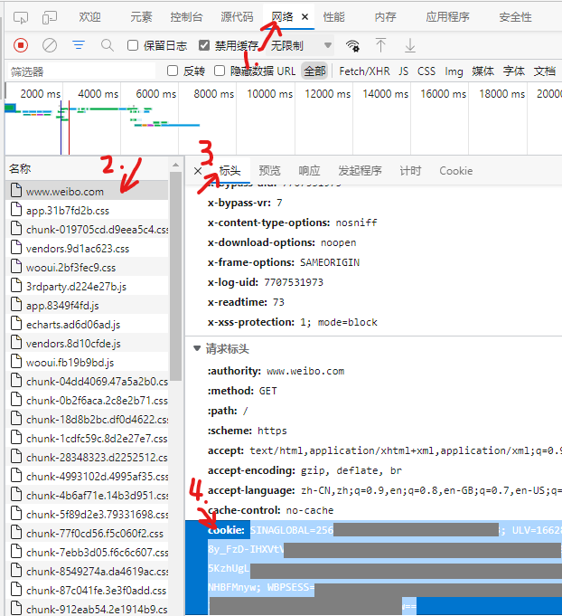

# 微博爬虫

爬取指定用户尽可能全面的信息。

## 已实现的功能

抓取用户个人基本信息。

抓取用户的所有微博，包括被转发的微博，支持长微博正文、图片ID和文件，可以只抓取指定日期后。

抓取用户互相关注的用户基本信息，可以包含间接互关，可以指定抓取用户粉丝门槛和数量上限。

## 使用方法

### 使用虚拟环境（推荐）

```shell
# 创建虚拟环境
python -m venv ./venv
# 进入虚拟环境
.\venv\Scripts\activate
```

### 安装依赖

```shell
pip install -r requirements.txt
```

### 获取cookie

访问[新浪微博网页版](https://www.weibo.com)，登录账号。

之后后按F12显示“开发人员工具”，按F5刷新，按图中依次点击，找到cookie并复制。_**cookie务必保密**_



### 配置和运行

首次运行将[config_simple.json5](./config_simple.json5)复制为[config.json5](./config.json5)

配置[config.json5](./config.json5)后再次运行，将执行抓取

```shell
python main.py
```

## 数据保存

所有数据保存到 output以用户id命名的文件夹

* 用户信息保存到 user.json
* 微博保存到mblog.json
* 互关保存到mutual_follow.json
* 微博附图保存到 image

## 配置说明

见[config_simple.json5](./config_simple.json5)

## 实现计划

### 功能

- [x] 配置文件使用JSON5
- [ ] 支持获取用户非互关的关注
- [ ] 下载头条文章
- [ ] 下载视频
- [ ] 通过将接口的返回值保存到文件，减少重复的网络请求
- [ ] 人类友好的显示抓取到的数据，特别是微博的附图

### 系统配置

- [x] 指定目标用户ID
- [x] 指定日期范围
- [x] cookie
- [x] 全局休息时间
- [ ] 图片、视频休息时间

### 用户信息

- [x] 用户个人信息
- [x] 互相关注的用户基本信息
- [ ] 保留不同时间爬取的不同版本的用户信息
- [ ] 互动的用户id

### 微博信息

- [x] 原创微博正文内容
- [x] 转发微博正文内容
- [x] 原创图片
- [x] 转发图片
- [ ] @的用户id
- [ ] 原创头条文章内容
- [ ] 转发头条文章内容
- [ ] 原创视频
- [ ] 转发视频
